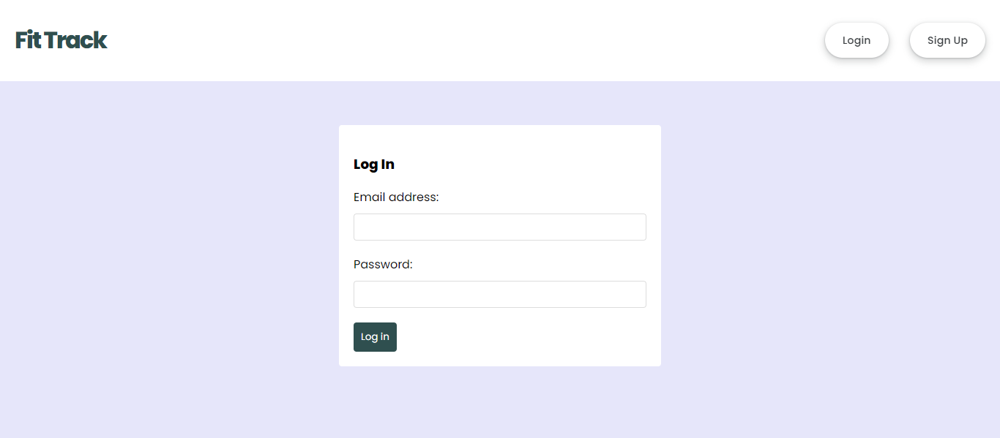

<h1>Fit Track</h1>

The projects is comprised of a **backend** part consisting of `node.js`, `express` and `mongoDB` parts, and of a **frontend** part consisting of a `react` project created with the `create-react-app` tool.

<h2>Stack</h2>

- **M**ongoDB: A general purpose, document-based, distributed database built for modern application developers and for the cloud era.
- **E**xpress: A minimal and flexible Node.js web application framework that provides a robust set of features for web and mobile applications.
- **R**eact: A JavaScript library for building user interfaces
- **N**ode.js: A JavaScript runtime built on [Chrome's V8 JavaScript engine](https://v8.dev/).

<h2>Installation</h2>
<ol>
<li>Clone this repository to your local machine
<li>Install dependencies by using npm install on the backend & frontend folders.
<li>Set up your environment variables by creating a .env file in the root of the project <ul> 
  <li>PORT=3000</li> 
  <li>MONGODB_URI=replace with your's</li> 
  <li>JWT_SECRET=your-secret-key </li> </ul>
<li>Start the backend sever by using 'npm start' on the root folder.
<li>Start the frontend sever by using 'npm start' on the client folder.
</ol>
<h2>Usage</h2>

<h3>Server</h3> The server runs on [http://localhost:PORT], where PORT is the value set in your .env file.

<h3>Client</h3> The client runs on [http://localhost:3000] by default. Once you start the development server, you can access the client by opening your web browser and navigating to [http://localhost:3000].

<h2>Demo</h2>
 
